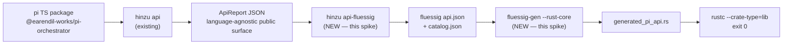

<!-- straitjacket-allow-file:duplication — design note; the pasted Rust sample intentionally mirrors generated_pi_api.rs verbatim as evidence, and the coverage tables repeat structural token shapes on purpose -->

# Spike: mechanically generating a "pi API in Rust" scaffold

**Status:** feasibility spike, complete. **Verdict: FEASIBLE** as a re-runnable
scaffold generator — not as a push-button full port. Evidence below.

## Problem

pidgin re-implements pi's surface in Rust. Today that surface is hand-ported
symbol by symbol: someone reads a pi TypeScript package, writes the matching
Rust types and traits, and repeats this every time pi moves upstream. That is
slow, and it silently drifts — nothing mechanically tells us which pi symbols
have changed, which are already ported, and which are still missing.

The question this spike answers: **can we mechanically generate the target Rust
surface for a pi package — DTOs, enums, and per-interface `Core` traits —
directly from pi's public TypeScript, and re-run it so it tracks upstream
drift?** If yes, the hand-port becomes "fill in the bodies against a generated,
re-generatable skeleton" instead of "transcribe the whole surface by hand."

## Pipeline (what was proven end to end)

The spike wires two existing tools together with two new pieces and proves the
whole chain emits Rust that `rustc` accepts (exit 0).



Plain text, for terminals without mermaid:

```
pi TS package
  → hinzu api                (existing)  → ApiReport JSON
  → hinzu api-fluessig       (NEW)       → fluessig api.json + catalog.json
  → fluessig-gen --rust-core (NEW)       → generated_pi_api.rs
  → rustc --crate-type=lib   exit 0
```

## What existed vs. what the spike built

**Already existed:**

- `hinzu api <path>` — emits a stable, language-agnostic **ApiReport JSON** of a
  package's *public* interface (TS via the TypeChecker, Rust via rustdoc-json,
  Python via `ty`). Types are captured as **rendered strings**, e.g.
  `"Promise<SpawnResponse | ErrorResponse>"`.
- fluessig's `emit_core_traits` — already produced a Rust
  `pub trait <Iface>Core { fn ...(...) -> anyhow::Result<T>; }` skeleton, but
  only **embedded inside** language backends (node/php/…); there was no
  standalone Rust output and no model/enum emission.

**Built in the spike (two new pieces, each its own draft PR):**

1. **`hinzu api-fluessig`** — a converter subcommand.
   `hinzu_core::fluessig_api::build_fluessig` is a pure function (passes hinzu's
   pure-region self-check) plus CLI I/O. Its hard part is a **parser for
   rendered TS type strings**: `Promise<…>` → async, `T[]` → list, `T | null` →
   nullable, `A | B` → union, a string-literal union → a catalog enum,
   PascalCase → model/enum reference, scalars mapped through. When it cannot
   resolve a shape it **degrades honestly to `Json` and counts every fallback**.
   (hinzu draft PR: zmaril/hinzu#35)
2. **`fluessig-gen --rust-core <out.rs>`** — reuses the shared
   `emit_core_traits_with` spine and *additionally* emits referenced models →
   Rust structs and enums → Rust enums, as a self-contained module depending
   only on `anyhow`. (fluessig draft PR: zmaril/fluessig#76)

The converter is pure and the fallback accounting is mechanical, so the coverage
numbers below are produced by the tool, not estimated by hand.

## Real generated output (excerpts from `generated_pi_api.rs`)

The lifted enum and two representative DTO structs — note the string-literal
union `InstanceStatus` became a real Rust enum, nullable fields became
`Option<T>`, and a referenced model became a typed field (`status:
InstanceStatus`):

```rust
#[derive(Debug, Clone, PartialEq, Eq)]
pub enum InstanceStatus {
    Starting,
    Online,
    Stopping,
    Stopped,
    Error,
}

#[derive(Debug, Clone)]
pub struct InstanceRecord {
    pub id: String,
    pub status: InstanceStatus,
    pub cwd: String,
    pub createdAt: String,
    pub lastSeenAt: Option<String>,
    pub label: Option<String>,
    pub sessionId: Option<String>,
    pub sessionFile: Option<String>,
    pub radiusPiId: Option<String>,
}

#[derive(Debug, Clone)]
pub struct SpawnResponse {
    pub r#type: String,
    pub instance: Option<InstanceSummary>,
    pub ok: bool,
    pub error: Option<String>,
}
```

A representative generated trait. The clean ops carry faithful types
(`Vec<InstanceRecord>`, `Option<InstanceRecord>`); the degraded ones still
appear in the trait but ride a `String`/`Json` placeholder where a callback or a
cross-package handle had no Rust home (`handle_rpc`'s `command`, the
`open_rpc_stream` `on_*` callbacks):

```rust
pub trait OrchestratorSupervisorCore: Sized + Send + Sync + 'static {
    fn get_instance(instance_id: String) -> anyhow::Result<Option<InstanceRecord>>;
    fn handle_rpc(instance_id: String, command: String) -> anyhow::Result<Option<String>>;
    fn list_instances() -> anyhow::Result<Vec<InstanceRecord>>;
    fn open_rpc_stream(
        instance_id: String,
        on_event: String,
        on_ui_request: String,
    ) -> anyhow::Result<Option<String>>;
    fn recover_after_restart() -> anyhow::Result<()>;
    fn shutdown() -> anyhow::Result<()>;
    fn spawn_instance(options: String) -> anyhow::Result<InstanceRecord>;
    fn stop_instance(instance_id: String) -> anyhow::Result<Option<InstanceRecord>>;
    fn update_instance(instance: InstanceRecord) -> anyhow::Result<()>;
}
```

Full output: [`generated_pi_api.rs`](./generated_pi_api.rs). Intermediate
fluessig IR: [`api.json`](./api.json), [`catalog.json`](./catalog.json). Full
numbers: [`coverage-stats.md`](./coverage-stats.md).

## Coverage results (pi orchestrator, 72 public items)

| Metric | Result |
|---|---|
| Produced a typed Rust artifact | **63 / 72 = 87.5%** |
| Emitted artifacts | 21 DTO structs + 1 enum + 3 traits (39 trait fns) |
| Dropped entirely | 9 / 72 = 12.5% (3 `const`, 6 non-enum type aliases) |
| Ops fully & faithfully typed | **24 / 39 = 62%** |
| Ops that compile but carry a `Json`-degraded param/return | 15 / 39 = 38% |
| Struct fields cleanly typed | **76 / 78 = 97%** |

Where the op-layer degradations came from (every `Json` fallback is counted):

| Cause | Count | Example |
|---|---:|---|
| unresolved cross-package / handle ref | 14 | `RpcCommand`, `ChildProcess` — named but not in the single-package surface |
| callback `=> void` param | 9 | `(event: AgentSessionEvent) => void` — no value type |
| inline object literal | 4 | anonymous `{ … }` param/return |
| unparsable type expression | 1 | a rendered type the parser could not decompose |

The read: **the DTO layer round-trips almost perfectly (97% field fidelity,
21/21 interfaces → structs)** — data shapes are the easy, high-value win. The op
layer's 38% loss is **dominated by pi's event-callback surface and by types
whose definitions live outside the single analyzed package**, not by converter
bugs. The converter resolves every reference that *is* present.

## Honest limitations

- **fluessig has no generics and drops visibility.** Generic pi types collapse;
  `pub`/private distinctions are not carried.
- **TS `number` is ambiguous** — mapped to `float64` (so
  `heartbeatIntervalMs: f64` even where an integer was intended). TS does not
  distinguish int from float.
- **Enum-lifting is heuristic.** A *named* string-literal union lifts cleanly
  (`InstanceStatus`), but only 1 of the package's 7 type aliases was such a
  union; the other 6 are model-unions / conditional types and are correctly
  *not* forced into enums (they are dropped, not mangled).
- **Callbacks and cross-package handles have no home** in a single-package,
  value-typed IR. They ride `Json`/`String` and are counted as degraded. A real
  generator would model them as streams/handles and would run over multiple pi
  packages together so cross-package refs resolve.
- **`Json` is a degradation, not a lie.** A degraded op still exists in the
  trait with the right name and arity; only the offending type is widened.

## Drift-tracking loop (designed, not yet wired)

The converter produces the target Rust **surface**. It does **not** decide which
of those symbols are *already implemented* in pidgin's crates — that is a
**separate join** against pidgin, and it is not part of this prototype.

- Today, the file-level join is **`hinzu port-diff`** (graph-based, file-level
  bands; already targets pidgin via `notes/port-pi-atilla.toml`).
- A surface-level **`hinzu api-diff`** (ApiReport-vs-ApiReport) is a teammate's
  **draft** (zmaril/hinzu#34, branch `feat/hinzu-api-diff`) — **not yet on
  main**. In its current state it graded pi-ai vs pidgin-ai at ~0.32
  conformance.

The intended re-runnable loop, once that join lands:

```
re-run hinzu api on new pi
  → re-run hinzu api-fluessig      (regenerate the target Rust surface)
  → api-diff / port-diff           (classify each symbol)
  → { already-ported | stub-needed | deferred }
```

Be clear: **the "already-ported vs. stub-needed vs. deferred" overlay is
designed but not built here.** This spike proves the *surface generation* half.

## Feasibility verdict

**Feasible, and worth continuing — as a scaffolding aid, not an auto-porter.**
The mechanical pipeline works end to end and emits compilable Rust, turning
~88% of a pi package's public surface into typed Rust artifacts, with the
DTO layer near-perfect (97% field fidelity). It is **not** a push-button full
port: the op layer loses ~38% to `Json` at the callback / cross-package edges,
and the "already-ported" classification still needs the `api-diff` join.

Frame it as what it is: **a re-runnable drift-tracking scaffold generator** —
surface + stubs + an honest coverage report — that replaces the symbol-by-symbol
transcription with "generate the skeleton, then fill in the bodies."

## What a full build-out would take

1. **Land `api-diff` (zmaril/hinzu#34)** so generated-vs-existing symbols get
   classified (already-ported / stub-needed / deferred) instead of just emitted.
2. **Richer hinzu type fidelity** — structured type references instead of
   rendered strings — to cut the `Json` fallback at its source.
3. **Callback / event-surface modeling** — give fluessig stream/manual shapes so
   pi's `=> void` event surface stops degrading to `Json`.
4. **An enum-lifting policy** — decide deterministically which unions become
   enums vs. tagged unions vs. `Json`, rather than the current heuristic.
5. **Cross-package type resolution** — run `hinzu api` over multiple pi packages
   together so `ChildProcess`, `RpcCommand`, and friends resolve instead of
   degrading.
6. **A wiring step** that emits into pidgin's crate layout, **respecting
   split-not-merge** (each generated piece lands in its own module file, never
   inlined into an existing one).
